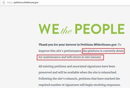
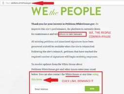
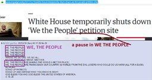
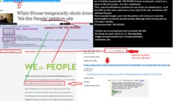
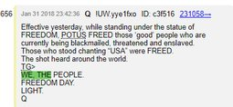
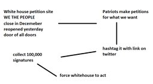
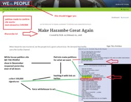
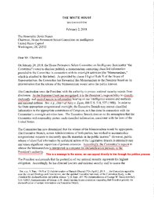
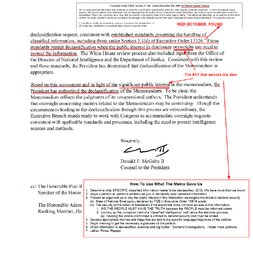

>Author's Note:  
>I believe for the first time in decades, maybe even centuries, that we have a chance to restore The United States of America to the principles upon which it was founded.  
>I also believe that if we do not take this chance now, we may never get another one.  
>It is these beliefs that have motivated me to share this message.  
  
  
#QAnon has shown us that massive corruption exists.  
The message was cryptic, and it took some time to decipher, but the light has finally revealed the truth.  
The revelation of this truth was no small feat, and so we must be vigilant to ensure that we respond appropriately.  
#QAnon not only revealed to us some of the corruption that exists in the darkness, but he has also placed a light on the path we must take to set things right.  
What path is this; what exactly has #QAnon told us to do?  
In the own words of the 8chan anon that figured it out:  
  
>WHERE WE GO ONE WE GO ALL  
>WE, THE PEOPLE  
>have forgotten how to PLAY  
>https://petitions.whitehouse.gov  
>ok the petition site has been down for some time now. it had this image up  
>WE the PEOPLE  
>said it would be up end of January  
  
  
>so i thought  
>Q posted WE, THE PEOPLE  
>6 times in one post..  
>a comma = a pause  
>pause in petition site  
>1+1=2  
>no coincidence  
  
  
>so i found out that the site had been out since  
>12-19-2017  
>and here's the Q post  
  
  
>Q posted on jan 31 about an hour before site came up  
  
> Effective yesterday, while standing under the statue of FREEDOM, POTUS FREED those ‘good’ people who are currently being blackmailed, threatened and enslaved.  
> Those who stood chanting “USA” were FREED.  
> The shot heard around the world.  
> TG>  
> WE, THE PEOPLE.  
> FREEDOM DAY.  
> LIGHT.  
> Q  
  
>So i assembled this to get people to make petitions  
>no takers  
  
  
  
  
  
  
>problem is..  
>need Americans to make and sign petition  
>so i said fuck it  
  
  
>another anon posted these. they are excellent  
>he connects the dots well with the Nunez letter.  
  
  
  
>We need to organize a petition campaign  
>create appropriate petitions  
>to obtain declassifications we need  
  
>Where we go one, we go all  
  
  
To be able to understand the true power of such a simple action, you must first understand a few things.  
  
For the first time in decades, The President of our government has pledged to return power to The People.  
Power should have been in the hands of The People all along, and always would have been had we not bought into the cleverly crafted lie perpetrated upon us by those that would think of themselves as "The Elite".  
Never forget that our Founding Fathers established The United States of America as a nation by The People, for The People.  
At the time The U.S. was founded, this was a revolutionary idea!  
  
In the past, nations were established by people who considered themselves "the nobility", all based upon the idea that they were superior to those they called "the common man".  
In this system, the nobles/king/leader/etc. had ownership of the land, and The People were made to manage the land to serve and enrich their leaders.  
The United States of America changed all this. The U.S. was established by The People, for The People.  
This means that, in The United States of America, The People have legal ownership of the land, and the purpose of the government is manage the land to serve and enrich The People.  
  
This idea, this one core belief that birthed our nation; this is where we start.  
It is the foundation, the very cornerstone of our response to the rampant corruption that #QAnon has been working to reveal to us.  
But, I want to be very clear about one specific thing, and that is what, exactly, our role is as the "We The People".  
Our job is to firmly and clearly communicate our beliefs and our vision for the future of The United States of America - or, said another way, to establish "The Will of The People".  
This is the basis upon which our elected representatives must act - it is this understanding that must never be lost.  
  
So, how do we respond when those we have elected have ignored our vision and rejected our beliefs in favor of their own?  
Where do we find the strength to take on the very government that we are so often encouraged to fear?  
To help us understand how to answer these questions, let's use a story to look at our situation in a different way.  
  
Imagine that you owned a business and some of the workers you had hired rejected your authority, and instead bossed you around, told you that you were stupid, repeatedly lied to your face, and conspired to steal from you and cover up their actions.  
What would you do with those workers? Would you promote them? Would you give them a raise? Or, would you fire them and have them answer to the courts for their crimes?  
  
Remember, in The United States of America, The People are the owners of the land, and the government is the servant we hire to manage it for us.  
We hired our elected representatives so that we can focus on more important things - life, liberty, and the pursuit of happiness.  
We don't need to micro-manage our government, we just need to tell them what our vision is for the country that we own.  
If they do a poor job executing on our vision, we fire them.  
If they lie to us and try to convince us that we are mistaken about all of this, that they are the owners and we are the servants, no matter how eloquent or legally complicated of an argument they make, we fire them.  
But, if they do a tremendous job, we praise them, promote them, and keep them around.  
We act exactly like any owner of any company would towards their workers.  
  
Are you starting to understand the power you have?  
Are you starting to understand why #QAnon has repeatedly said we have more than we know?  
All we need to do is understand who we really are and start acting like it.  
  
Many of you may not understand how signing a petition will change anything.  
Many of you may feel like you have been screaming for ages now, but your voice has fallen on deaf ears.  
You have been lied to - you have been convinced that your greatest power to effect change is worthless, and so you may think petitioning won't do anything.  
#QAnon has told us the truth, setting us free from the lies that convinced us to weaken ourselves.  
#QAnon has revealed to us the path we must take to set things right.  
  
We need to understand how, as owners of The United States of America, we voice our disapproval of the job government is doing with our land.  
#QAnon has given us a procedure to follow - so let's follow it.  
Let's use the method #QAnon has pointed to, and let us make our voices heard.  
We must act with wisdom and honesty. We must reject all messages of fear and instead be motivated only by love.  
We must each take personal responsibility to fix our nation, while simultaneously combining our efforts with all others that are doing the same.  
I believe that in so doing and through our good example, we will also encourage our brothers in sisters in other lands to do the same in their own nations.  
I believe this is how we restore Earth to the Garden of Eden is was always meant to be.  
  
Focus on what you believe and your vision for the future of your nation.  
Petition your government anytime you see evidence that they are in violation.  
Resist the urge to be bossy, or demand specific things.  
Instead, word your petitions in such a way that it is clear that you view certain actions the government has taken to be in violation of our beliefs.  
The President has shown us that he wants to work according to the Will of The People, so be clear on what action you expect him to take.  
  
TL,DR takeaway:  
  
You, collectively with all other citizens of The United States of American, own the land of The United States of America, and all the public assets therein.  
The government is the servant you have hired to manage your property so that you can focus on more important things - life, liberty, and the pursuit of happiness.  
The petition process is how you tell the government that they are in violation of what type of work we expect them to do as they manage the nation that we own.  
Be careful not to micro-manage the elected representatives we hire, but instead we must communicate clearly our beliefs and the vision we have for our country.  
If the servants we appoint to the government do a good job in upholding our beliefs and establishing our vision, we honor them and keep them around.  
If they do a poor job, we fire them.  
If they attempt to lie to us, steal from us, or conspire against us, we recognize them as the criminals they are and demand they be turned over for Justice.  
This is how you live as a patriot. This is how you act as a citizen of The United States of America.
